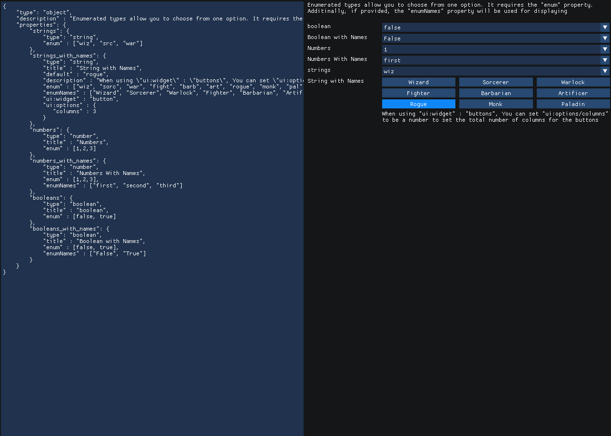
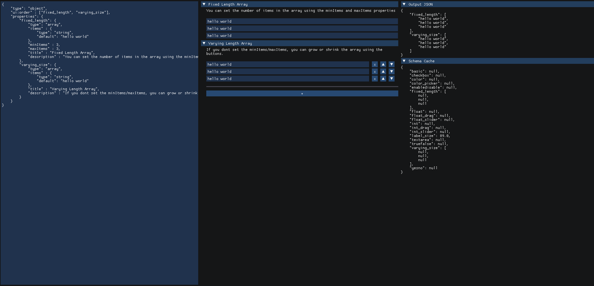

# ImJSchema 

An ImGui library to build Form UIs from Json Schemas. Based on [React JSON Schema Forms](https://rjsf-team.github.io/react-jsonschema-form/).


## Dependencies

* ImGui
* nlohmann::json

## Usage 

ImJSchema is a header-only library. You can include it as a submodule and then add the subdirectory to your CMakeLists.txt file

```cmake
add_subdirectory(third_party/ImJSchema)


# Link against the target
target_link_libraries( .... PUBLIC ImJSchema::ImJSchema)
```

There is only one function that you really need to use. the `drawSchemaWidget`. 
It requires 3 json objects:


```c++
namespace IJS = ImJSchema;

// the schema which that you wish to draw
const auto schema = IJS::json::parse(R"foo(
            {
                "type": "number"
            })foo");


// The value of the widgets will be stored
// in this json object
static ISJ::json value = {};

// The cache used for storing temporary widget data
// such as which index a dropdown menu is currently using
// This is static for the purposes of this example
// but should probably be stored somewhere else
static ISJ::json cache = {};

if(IJS::drawSchemaWidget("object",
                         value,
                         schema,
                         cache))
{
    // return a string which contains what was the
    // last widget that was modified
    auto lastWidgetPath =  IJS::getModifiedWidgetPath();

    std::cout << value.dump(4) << std::endl;
}
```

## Examples 

See [examples.cpp](example.cpp).

## Screen Shots

### Booleans


### Numbers


### Strings


### Enumerated Types


### Arrays



## References and Definitions

The specification for Json Schemas support references in the form of:

```json
{
    "myproperty" : {
        "$ref" : "#/$defs/mydefinition"
    },
    "$defs" : {
        "mydefinition" : {
            "type" : "number"
        }
    }
}
```

This library doesn't support references directly, but helper functions are provided to 
expand a json object which contains references.

```c++
auto schema = IJS::json::parse( R"foo(
{
    "myproperty" : {
        "$ref" : "#/$defs/mydefinition"
    },
    "$defs" : {
        "mydefinition" : {
            "type" : "number"
        }
    }
}
)foo");
IJS::jsonExpandAllReferences(schema);

// or if $defs is in another object:
IJS::jsonExpandAllReferences(schema, definitionsObject);

// you can now call the draw widget function
if(IJS::drawSchemaWidget("object",
                            value,
                            schema,
                            cache))
{
    std::cout << value.dump(4) << std::endl;
}
```

## Custom Widgets

You can add your own custom widgets to by providing a lambda function to draw it.

```c++

IJS::detail::widgets_all["number/my_custom_number_widget"] =
[](char const* label, IJS::json & value, IJS::json const& _schema, IJS::json & _cache, float object_width) -> bool
{
    (void)_sch;
    (void)object_width;
    auto W = ImGui::GetContentRegionAvail().x;

    // Use the "cache" object to store any temporary data
    // that may be used for drawing your widget
    float w = IJS::JValue(cache, "pos", 0.0f);
    w += 1.0f;
    if(w > W)
        w = 0;
    cache["pos"] = w;

    if( ImGui::Button(label, {w,0}) )
    {
        // when you set the value
        // make sure you return true
        value = value.get<float>() + 1.0f;
        return true;
    }

    return false;
};

```

You can then use the `ui:widget` property to use that widget

```json
{
    "type" : "number",
    "ui:widget" : "my_custom_number_widget"
}
```

# Compiling The Examples

## Compile for Desktop
 
```bash
mkdir build
cd build
conan install ..

cmake .. -DCMAKE_MODULE_PATH=$PWD

```

## Compiling for WASM


```bash
mkdir build_emcc

EMC=PATH/TO/EMSCRIPTEN_SDK
source $EMC/emsdk_env.sh 
export CC=$(which emcc)
export CXX=$(which em++)

conan install ../conanfile_emcc.txt -s os=Emscripten -s arch=wasm -s compiler=clang -s compiler.version=17

emcmake cmake .. -DCMAKE_MODULE_PATH=$PWD

make

python3 -m http.server
``
