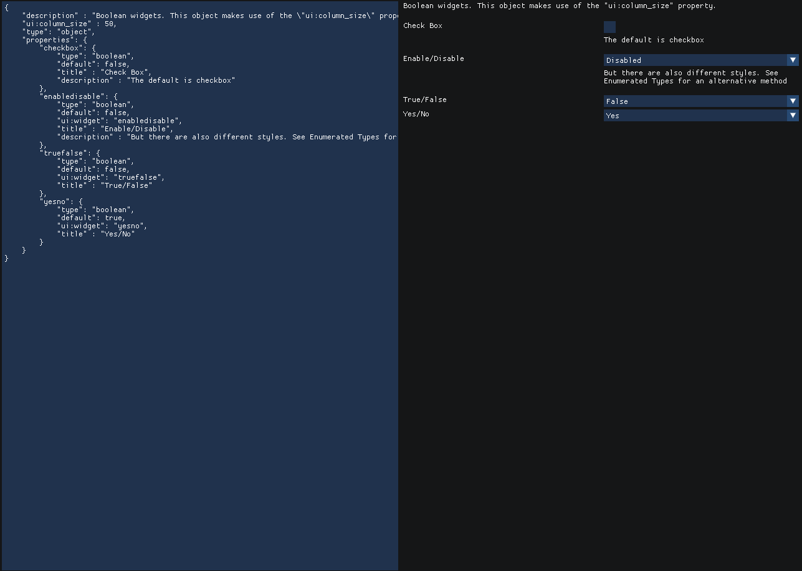
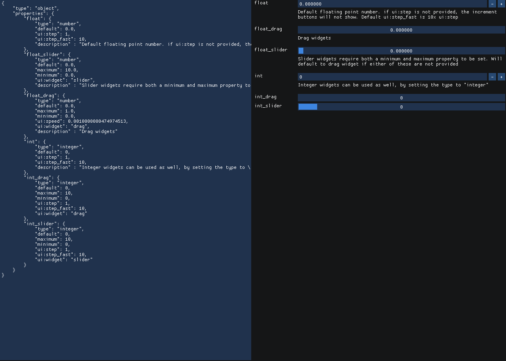

# ImJSchema 

An ImGui library to build Form UIs from Json Schemas. Based on [React JSON Schema Forms](https://rjsf-team.github.io/react-jsonschema-form/).


## Dependencies

* ImGui
* nlohmann::json

## Usage 

There is only one function that you really need to use. the `drawSchemaWidget`. 
It requires 3 json objects:


```c++
namespace IJS = ImJSchema;

// the schema which that you wish to draw
const auto schema = IJS::json::parse(R"foo(
            {
                "type": "number"
            })foo");


// The value of the widgets will be stored
// in this json object
static ISJ::json value = {};

// The cache used for storing temporary widget data
// such as which index a dropdown menu is currently using
static ISJ::json cache = {};

if(IJS::drawSchemaWidget("object",
                         value,
                         schema,
                         cache))
{
    std::cout << value.dump(4) << std::endl;
}
```

## Examples 

See `examples.cpp`


## Main Widgets

The `drawSchemaWidget` requires a Json Schema `object` to be passed into it.
Each object has the following `properties`

| Property    | Required   | Description   |
| ------------| ---------- | ------------- |
| type        | required   | one of: "number", "integer", "boolean", "string", "array", "object" |
| default     | optional   | The initial value. This must be the same type as `"type"` |
| title       | optional   | The visble name that will be rendered for the widget |
| ui:help     | optional   | String containing the tooltip |

### Booleans

To draw widgets for booleans, you 

| Property    | Required   | Description   |
| ------------| ---------- | ------------- |
| type        | required   | "boolean"  |
| default     | optional   | `true`` or `false` |
| ui:widget   | optional   | one of :"yesno", "truefalse", "enabledisable"  |




### Numbers 

| Property    | Required   | Description   |
| ------------| ---------- | ------------- |
| type        | required   | "number" or "integer" |
| default     | optional   | number |
| minimum     | optional   | number; minimum value to be clamped at |
| maximum     | optional   | number; maximum value to be clamped at |
| ui:widget   | optional   | one of :"drag", "slider". Slider requires both minimum and maximum to be defined  |
| ui:step    | optional   | number indicating how fast the step should be (drag) |
| ui:step_fast    | optional   | number indicating how fast the fast step should be (drag) |




### Strings 

| Property    | Required   | Description   |
| ------------| ---------- | ------------- |
| type        | required   | "string"      |
| default     | optional   | string value |
| ui:widget   | optional   | one of :"textarea", "color", "color_picker"  |
| ui:option   | optional   | object |

If `"ui:widget" == "textarea"`, then the following properties for `ui:options` are available

| Property    | Required   | Description   |
| ------------| ---------- | ------------- |
| rows        | optional   | integer; number of rows for the multi-line text box   |


### Arrays

| Property    | Required   | Description   |
| ------------| ---------- | ------------- |
| type        | required   | "array"      |
| items       | optional   | object; the schema of the item is holds |
| minItems    | optional   | positive integer. The minium number of values |
| maxItems    | optional   | positive integer. The maximum number of values |
| default     | optional   | array of "items" |


```json
{
    "type" : "array",
    "items" : {
        "type" : "number",
        "ui:widget" : "drag"
    },
    "minItems" : 3,
    "maxItems" : 10
}
```
### Object

| Property    | Required   | Description   |
| ------------| ---------- | ------------- |
| type        | required   | "object"      |
| properties  | optional   | object; Object containing keys of schemas |
| ui:order    | optional   | array of strings; The order the properties should be drawn in |
| ui:column_size | optional | number between `1-99` indicating a relative size of the labels column |

## Advanced

## Enumerated Types

Enumerated types is drawn usually as a Combo Box. 

| Property    | Required   | Description   |
| ------------| ---------- | ------------- |
| type        | required   | "object"      |
| enum        | required   | An array of json `type`s the. enum.length() == enumNames.length() |
| enumNames   | optional   | An array of strings which will be shown in the combo box. |


## References and Definitions

The specification for Json Schemas support references in the form of:

```json
{
    "myproperty" : {
        "$ref" : "#/$defs/mydefinition"
    },
    "$defs" : {
        "mydefinition" : {
            "type" : "number"
        }
    }
}
```

This library doesn't support references directly, but helper functions are provided to 
expand a json object which contains references.

```c++
auto schema = IJS::json::parse( R"foo(
{
    "myproperty" : {
        "$ref" : "#/$defs/mydefinition"
    },
    "$defs" : {
        "mydefinition" : {
            "type" : "number"
        }
    }
}
)foo");
IJS::jsonExpandAllReferences(schema);

// or if $defs is in another object:
IJS::jsonExpandAllReferences(schema, definitionsObject);

// you can now call the draw widget function
if(IJS::drawSchemaWidget("object",
                            value,
                            schema,
                            cache))
{
    std::cout << value.dump(4) << std::endl;
}
```