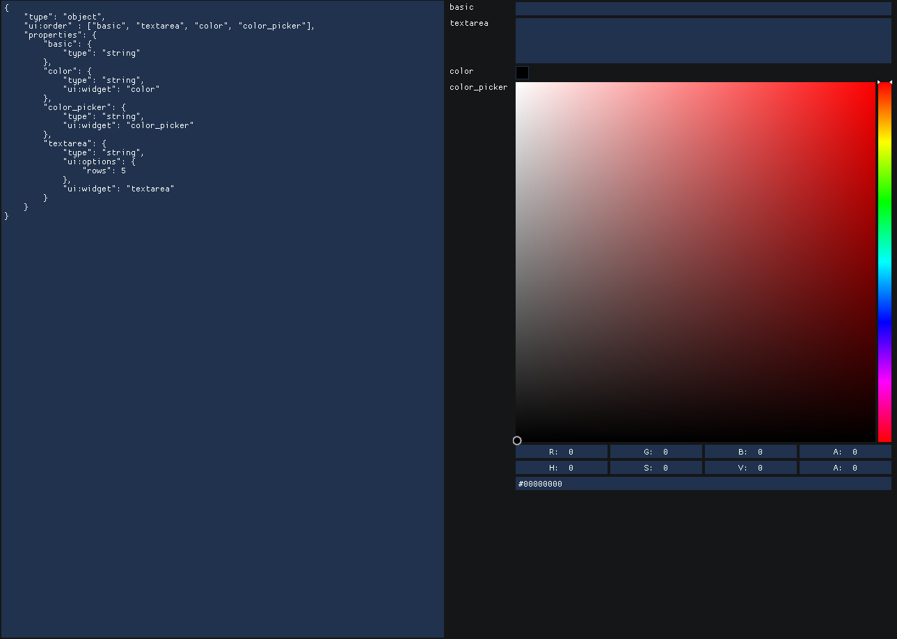

# ImJSchema 

An ImGui library to build Form UIs from Json Schemas. Based on [React JSON Schema Forms](https://rjsf-team.github.io/react-jsonschema-form/).


[EXAMPLE WebAssembly](https://filedn.eu/l0rnKqYfU3SSI61WTa9844f)

## Dependencies

* ImGui
* nlohmann::json

## Compiling The Examples

The examples uses the Conan Package Manager to download the Json library and SDL
It is not required for regular use.

### Compile for Desktop

```bash
mkdir build

conan install conanfile.py --build=missing -s:h "&:build_type=Debug" -of build

cmake --preset conan-debug

cmake --build . --conan-debug

```

### Compiling for WASM


```bash
mkdir build_emcc

EMC=/PATH/TO/EMSCRIPTEN_SDK
source $EMC/emsdk_env.sh 
export CC=$(which emcc)
export CXX=$(which em++)

# Choose the appropriate version for the compiler
# or create a conan profile
conan install conanfile.py --build=missing -s:h "&:build_type=Debug" -of build_emcc -s os=Emscripten -s arch=wasm -s compiler=clang -s compiler.version=20

cmake --preset conan-debug -DEMSCRIPTEN=1

cmake --build . --preset conan-debug

cd build_emcc
python3 -m http.server
```

## Usage 

ImJSchema is a header-only library. You can include it as a submodule and then add the subdirectory to your CMakeLists.txt file

```cmake
add_subdirectory(third_party/ImJSchema)

# Link against the target
# Note you must also link against the Nlohmann Json library
target_link_libraries( .... PUBLIC ImJSchema::ImJSchema)
```

There is only one function that you need to use, the `drawSchemaWidget`. 
It requires 3 json objects:


```c++
namespace IJS = ImJSchema;

// the schema which that you wish to draw
const auto schema = IJS::json::parse(R"foo(
{
    "type": "object",
    "properties" : {
        "number" : { "type" : "number"},
        "bool"   : { "type" : "boolean"},
        "string" : { "type" : "string"}
    }
})foo");

// The value of the widgets will be stored
// in this json object
static ISJ::json value = {};

// The cache used for storing temporary widget data
// such as which index a dropdown menu is currently using
// This is static for the purposes of this example
// but should probably be stored somewhere else
static ISJ::json cache = {};

// Combine all the references into a single object
IJS::WidgetDrawInput in { "object", value, schema, cache};
if(IJS::drawSchemaWidget(in))
{
    // return a string which contains the JSON path
    // of the last modified widget
    auto lastWidgetPath =  IJS::getModifiedWidgetPath();

    std::cout << "Value of last modified widget: " << value.at(lastWidgetPath) << std::endl;

    std::cout << value.dump(4) << std::endl;
}
```

## Examples 

See [main.cpp](main.cpp). This example provides an overall demo of how the 
library works and its features


## Screen Shots

### Booleans


### Numbers


### Strings


### Enumerated Types


### Arrays


### Objects

| Property      | Description  | 
| ----------    | --- | 
| required      | Array of strings. Property names that are required  | 
| ui:widget     | One of: "collapsing", "header"  | 
| ui:showReset  | Boolean. Shows the "Reset" button  | 
| ui:resizable  | Boolean. Whether the label column is resizable  | 
| ui:addPropertyButtonLabel  | String. The label used for the Add Property button, default is "Add Property"  | 


## References and Definitions

The specification for Json Schemas support references in the form of:

```json
{
    "myproperty" : {
        "$ref" : "#/$defs/mydefinition"
    },
    "$defs" : {
        "mydefinition" : {
            "type" : "number"
        }
    }
}
```

This library doesn't support references directly, but helper functions are provided to 
expand a json object which contains references.

```c++
auto schema = IJS::json::parse( R"foo(
{
    "myproperty" : {
        "$ref" : "#/$defs/mydefinition"
    },
    "$defs" : {
        "mydefinition" : {
            "type" : "number"
        }
    }
}
)foo");
IJS::jsonExpandAllReferences(schema);

// or if $defs is in another object:
IJS::jsonExpandAllReferences(schema, definitionsObject);

// you can now call the draw widget function
if(IJS::drawSchemaWidget("object",
                            value,
                            schema,
                            cache))
{
    std::cout << value.dump(4) << std::endl;
}
```

## Custom Widgets

You can add your own custom widgets to by providing a lambda function to draw it.

```c++

IJS::detail::widgets_all["number/my_custom_number_widget"] =
    [](IJS::WidgetDrawInput & in) -> bool
{
    auto W = ImGui::GetContentRegionAvail().x;

    // Use the "cache" object to store any temporary data
    // that may be used for drawing your widget
    float w = IJS::JValue(in.cache, "pos", 0.0f);
    w += 1.0f;
    if(w > W)
        w = 0;
    in.cache["pos"] = w;

    if( ImGui::Button(in.label, {w,0}) )
    {
        // when you set the value
        // make sure you return true
        in.value = in.value.get<float>() + 1.0f;
        return true;
    }

    return false;
};

```

You can then use the `ui:widget` property to use that widget

```json
{
    "type" : "number",
    "ui:widget" : "my_custom_number_widget"
}
```


